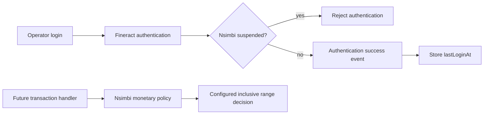

# Nsimbi SACCO Core Banking System — User and Roles implementation report

## Status

This is an in-progress Phase 1 foundation on `feat/user-role-administration`, based on local `develop` commit `9493c8b71f439db26dfa0006547ab1e0992ced4b`. No commit has been made. The supplied requirements comparison is now stored verbatim at `docs/requirements/user-roles-requirements-comparison.md`.

## What is in this logical unit

Fineract already has an application-user record (`m_appuser`), multiple roles (`m_role`), role permissions (`m_permission`), an optional Staff link, a primary Office, command auditing, password reset, login retry locking, notifications, tellers and cashiers. The Nsimbi work intentionally builds alongside these records instead of confusing an operator with a SACCO client/member.

The migration creates additive Nsimbi tables: `nsimbi_user_security_profile`, `nsimbi_user_office_assignment`, `nsimbi_role_operating_hours`, and `nsimbi_user_monetary_authority`. It adds five Fineract RBAC permission codes: `SUSPEND_USER`, `REACTIVATE_USER`, `MANAGE_USER_BRANCH_ASSIGNMENTS`, `MANAGE_ROLE_OPERATING_HOURS`, and `MANAGE_USER_MONETARY_AUTHORITY`.

`NsimbiUserSecurityProfile` records administrative suspension and a successful `lastLoginAt`. The existing `LoginAttemptEventListener` records the timestamp only from Spring Security's success event. `PlatformUserDetailsChecker` rejects a suspended operator before authentication completes. A failed attempt therefore cannot update the timestamp.

`NsimbiMonetaryAuthorityPolicyService` provides a future transaction-handler boundary. It uses `BigDecimal`, explicit uppercase ISO currency, and inclusive comparisons. Its entity constructor rejects a minimum greater than a maximum. It returns false for an absent authority; this is deliberately not yet wired into banking transactions, so existing users are not locked out during migration.



## Deferred decisions and limitations

- Public management APIs, command handlers, authenticated-session invalidation, DTO extensions, role-hours validation/enforcement, branch-assignment validation/enforcement, and transaction-handler enforcement remain deferred. The tables are persisted only; they are not presented as complete features.
- Role disablement currently cannot be applied while the role is assigned in core Fineract. That conflicts with the agreed rule and needs a targeted core change with regression coverage.
- The teller model is office-scoped and references debit/credit GL accounts; a cashier is a Staff assignment valid for a period. Please decide whether the requirement's “Till” means a Fineract Teller, a Cashier assignment, a GL account, or a new SACCO till concept before behavioural enforcement is designed.
- Notifications remain Fineract in-application notifications; product-specific License and Msacco event meanings are not invented here.

## Requirements traceability

| Requirement | Existing Fineract Capability | Nsimbi Extension | Implementation Status | Files | Tests | Deferred Reason |
| --- | --- | --- | --- | --- | --- | --- |
| Separate operator identity, optional Staff and primary Office | `m_appuser`, optional Staff, required Office | No separate contact record | Reused / Deferred | AppUser core model; Nsimbi tables | Existing Fineract tests | Phone/contact decision deferred |
| Suspension/reactivation and readable status | Account enabled/locked plus login retry lock | Profile has `suspended`; authentication checker rejects it | Persisted and authentication-enforced; not API-authorized | Security profile, checker, listener | Focused tests passed | Commands/APIs and existing-session invalidation deferred |
| Successful last login only | Authentication success/failure events | `lastLoginAt` updated only by success listener | Enforced at event boundary | LoginAttemptEventListener, security service | Focused tests passed | Persistence integration test deferred |
| Multiple roles and disabled-role assignment behaviour | Many-to-many roles; core rejects disabling assigned role | None | Reused / Deferred | Fineract Role service | None added | Requires approval for smallest compatible core change |
| Additional branch assignment | Primary Office only | Assignment table | Persisted only | 0242 migration | None | Validation, policy and API deferred |
| Operating hours in Africa/Kampala | None | Clock bean and hours table | Persisted / timezone configured only | Clock config, 0242 migration | None | Validator, most-restrictive-role policy and boundaries deferred |
| Ten monetary authority pairs | None | Ten enum values, authority table and inclusive policy | Persisted, validated in constructor, policy callable; not transaction-enforced | Monetary authority classes, 0242 migration | Focused tests passed | Management API and rollout activation deferred |
| Notifications and preferences | In-application notifications | None | Deferred | Existing notification module | None | Event meanings and scope rules need product decisions |
| Till and Chart Accounts | Teller has office and debit/credit GL accounts; Cashier links Staff to Teller | None | Deferred | Teller/cashier services | None | Teller, Cashier, GL and SACCO till are distinct concepts |

## Verification

`git diff --check` completed with no output and `xmllint --noout fineract-provider/src/main/resources/db/changelog/tenant/parts/0242_nsimbi_user_roles_foundation.xml` completed successfully. Focused tests cover administrative suspension, successful-login tracking with a fixed clock, failure-event non-tracking, inclusive authority boundaries, a missing authority, and an invalid range.

The Gradle build declares a Java 25 toolchain. Terminal verification used OpenJDK 25.0.4 (Java and Javac) with Gradle 8.14.5 and a writable `/home/ib-s-muhoza/.gradle` cache. The focused commands used a command-only 4 GiB Gradle heap; no global configuration was changed.

The focused suite was invoked as follows:

```bash
./gradlew :fineract-provider:test \
  --tests org.apache.fineract.infrastructure.security.service.LoginAttemptEventListenerTest \
  --tests org.apache.fineract.infrastructure.security.service.PlatformUserDetailsCheckerTest \
  --tests org.apache.fineract.nsimbi.userroles.domain.NsimbiUserMonetaryAuthorityTest \
  --tests org.apache.fineract.nsimbi.userroles.service.NsimbiMonetaryAuthorityPolicyServiceTest \
  --tests org.apache.fineract.nsimbi.userroles.service.NsimbiUserSecurityServiceTest \
  --no-daemon --console=plain --stacktrace --info
```

The focused suite completed with exit code `0` and `BUILD SUCCESSFUL`: all five focused test classes passed, executing 11 tests with zero failures, errors, or skips. Gradle reported the production and test compilation tasks as up-to-date, so this verification used existing compiled outputs where those tasks were not recompiled.

The earlier build interruptions were caused by host memory exhaustion: multiple Gradle daemons and VS Code processes consumed excessive RAM. This was an environment failure, not a code failure. Database/Liquibase integration against a live test database and Docker-dependent integration behaviour remain unverified. All deferred module scope listed above remains deferred.

## Licensing

No Apache licence, NOTICE, copyright, or attribution files were removed or altered. New Java files must receive the repository's full Apache header before this work is ready for review.
